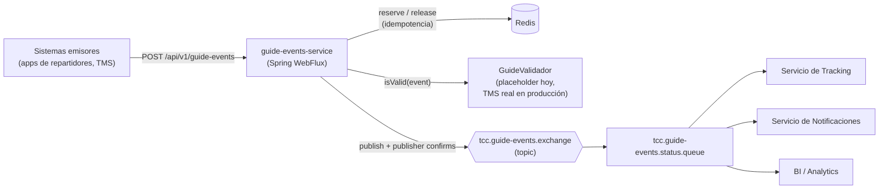
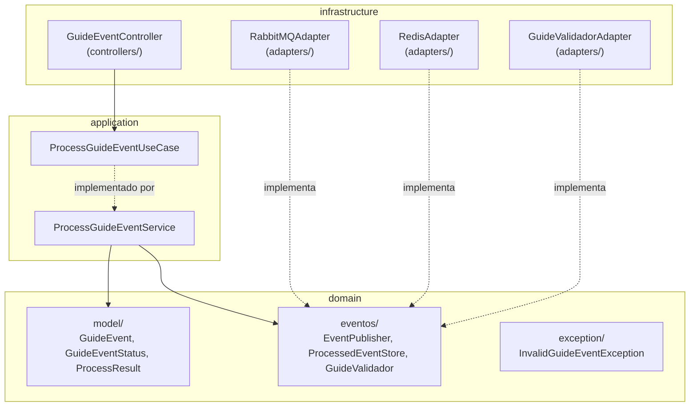
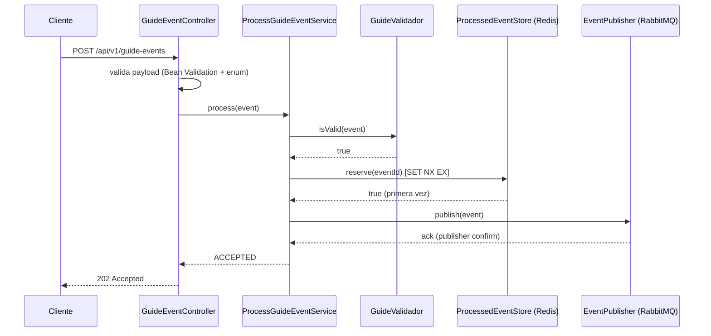
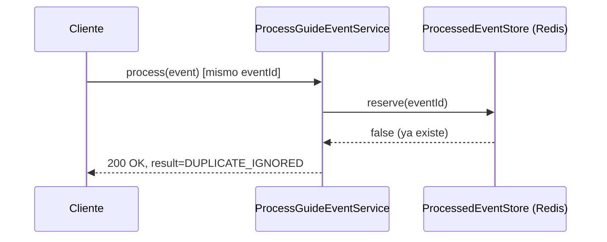
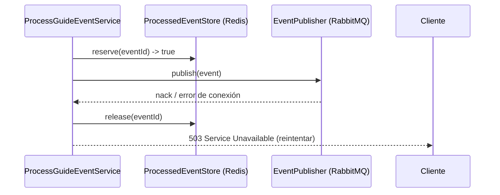

# guide-events-service

API REST reactiva que recibe un evento de cambio de estado de una guía (creada, en tránsito, entregada, novedad, etc.), valida que sea un caso real, evita procesarlo dos veces, y lo publica en RabbitMQ para que otros sistemas (tracking, notificaciones al cliente, BI) lo consuman casi en tiempo real.

Construido como ejercicio previo a una conversación técnica sobre arquitectura de alta concurrencia para TCC (logística/mensajería). Alcance deliberadamente acotado — no todas las decisiones de arquitectura discutidas están implementadas en código, solo las que cambian el comportamiento de este servicio; el resto queda documentado como decisión consciente.

## Stack

- Java 21, Spring Boot 4.0.7, Gradle (Kotlin DSL)
- WebFlux (no bloqueante) + reactor-rabbitmq para publicar en RabbitMQ
- Redis (reactivo, vía Lettuce) para idempotencia
- JUnit 5, Mockito, reactor-test (`StepVerifier`), JaCoCo (gate 90%)

## 1. Contexto de negocio

En temporada pico, la generación y el rastreo de guías dispara el volumen de eventos de estado (`CREADA`, `RECOLECTADA`, `EN_TRANSITO`, `EN_REPARTO`, `ENTREGADA`, `NOVEDAD`, `DEVUELTA`, `CANCELADA`). La solución necesita, simultáneamente:

- **No perder eventos** aunque el broker o un servicio downstream tenga fallas transitorias.
- **No degradar la operación** — el servicio de ingesta sigue aceptando tráfico aunque sistemas externos (TMS, servicio de guías) estén lentos o caídos.
- **No duplicar efectos visibles al cliente** — una guía no debe generar dos notificaciones por el mismo evento.
- **Escalar horizontalmente** sin que la corrección dependa de que las peticiones caigan siempre en la misma instancia.

`guide-events-service` es el punto de entrada: recibe el evento, lo valida, evita procesarlo dos veces, y lo publica en un exchange de RabbitMQ para que lo consuman los sistemas de tracking, notificaciones y BI.

## 2. Arquitectura de alto nivel — componentes y flujo de datos



**Por qué un exchange topic:** permite enrutar a futuro por tipo de evento (ej. notificaciones solo para `ENTREGADA`) agregando bindings nuevos, sin tocar el productor ni los consumidores existentes.

## 3. Arquitectura interna: hexagonal (ports & adapters)



```
domain/
  model/           → GuideEvent, GuideEventStatus, ProcessResult
  eventos/         → EventPublisher, ProcessedEventStore, GuideValidador
  exception/       → InvalidGuideEventException, EventPublishingException
application/       → ProcessGuideEventUseCase, ProcessGuideEventService (el caso de uso)
infrastructure/
  controllers/     → GuideEventController, DTOs, manejo de errores
  adapters/        → RabbitMQAdapter, RabbitMQConfig, RedisAdapter, GuideValidadorAdapter
  config/          → AppConfig
```

Las dependencias apuntan hacia adentro: `domain` y `application` no conocen Spring Web, RabbitMQ ni Redis. Cada adaptador implementa una interfaz de `domain/eventos`; cambiar de tecnología es escribir un adaptador nuevo, sin tocar el caso de uso ni sus pruebas.

**Por qué las interfaces de salida (`EventPublisher`, `ProcessedEventStore`, `GuideValidador`) viven en `domain/eventos` y no en `application`:** siguen el mismo principio que un repositorio en DDD clásico — la interfaz expresa una necesidad del dominio ("necesito anunciar esto", "necesito saber si ya lo procesé", "necesito saber si esta guía es real"), y la implementación concreta (RabbitMQ, Redis, el futuro servicio de guías) es un detalle de infraestructura. `ProcessGuideEventUseCase`/`ProcessGuideEventService` sí se quedan en `application` porque son orquestación (qué hacer y en qué orden), no una necesidad del dominio en sí.

## 4. Flujo de una petición

### 4.1 Evento nuevo → aceptado



### 4.2 Evento duplicado → ignorado sin republicar



### 4.3 Falla al publicar → se libera la reserva



Liberar la reserva es la parte no obvia: si no se libera, un reintento legítimo del cliente encontraría la clave ya marcada y se trataría como duplicado — perdiendo el evento en vez de reintentarlo.

## 5. Decisiones de diseño y trade-offs

### 5.1 Reactivo de punta a punta (Mono), Flux solo donde la librería lo exige

Cada request HTTP es un evento — cardinalidad 1 — por eso `Mono` en controller, caso de uso e interfaces de dominio. `Flux` aparece únicamente en `RabbitMQAdapter`, porque `Sender.sendWithPublishConfirms` de reactor-rabbitmq está diseñado alrededor de `Flux` para lograr throughput. Usar `Flux` en el resto sería forzar cardinalidad-N donde siempre hay un solo elemento.

**Ventaja:** ningún hilo se bloquea esperando el ack del broker — un pool pequeño de hilos Netty puede tener miles de requests concurrentes en vuelo, a diferencia de un stack bloqueante (Spring MVC + `RabbitTemplate`).
**Costo:** código reactivo es más difícil de leer/depurar para quien no conoce Project Reactor; stack traces menos directos.

### 5.2 Idempotencia: patrón *Idempotent Consumer* con reserva atómica en Redis

`ProcessedEventStore.reserve(eventId)` usa `SET NX EX` (atómico en Redis): si el mismo `eventId` llega dos veces casi al mismo tiempo —incluso a instancias distintas—, solo una gana la reserva y publica. Es el mismo patrón documentado en [microservices.io](https://microservices.io) como *Idempotent Consumer*, y el mismo mecanismo que usa Stripe con su header `Idempotency-Key` (24h en su caso; aquí 60 minutos, configurable).

**Por qué Redis y no una tabla relacional:** el patrón de acceso (escritura atómica, altísima frecuencia, vida corta con TTL nativo) es exactamente para lo que Redis está optimizado. El TTL es gratis en Redis; en una BD relacional requeriría un job de limpieza aparte.

**Qué no es esto:** no es un caché en el sentido clásico — es una primitiva de coordinación distribuida, por eso se usa el cliente Redis directo y no `@Cacheable`.

**Límite consciente:** la deduplicación de largo plazo es responsabilidad del consumidor final, que de todas formas necesita su propia escritura idempotente por `eventId` — esta reserva es una salvaguarda de corto plazo, no el mecanismo de idempotencia de todo el sistema extremo a extremo.

### 5.3 `GuideValidador`: puerto real, implementación placeholder explícita

Antes de aceptar un evento, el caso de uso pregunta `guideValidador.isValid(event)`. Hoy `GuideValidadorAdapter` siempre responde `true` — documentado así en el propio código, no simulado con una base de datos ficticia. No existe ningún otro sistema (TMS) con el que integrar en este alcance; el puerto deja explícito *dónde* debe conectarse la integración real.

### 5.4 Confirmaciones del broker — no perder eventos

El `Mono` de `publish()` solo completa cuando RabbitMQ confirma haber aceptado el mensaje — si el broker no confirma o rechaza, la petición HTTP responde `503` para que el cliente reintente. Así se evita perder eventos silenciosamente.

### 5.5 Qué queda deliberadamente fuera del código

| Tema | Por qué no está en el código | Cómo se resolvería |
|---|---|---|
| **Validación de existencia de guía / transición de estado** | Requeriría acoplar la disponibilidad de este servicio a la del TMS, o mantener estado local duplicado | Integración síncrona real detrás de `GuideValidador`, con circuit breaker |
| **Dead-letter queue** | No cambia la arquitectura, es una extensión de argumentos en `RabbitMQConfig` | `x-dead-letter-exchange` + cola DLQ |
| **Autenticación/autorización entre sistemas** | "Cualquiera con el API" es un problema de *quién* llama, no de *qué* datos llegan | API key / mTLS / OAuth2 en el borde |
| **Observabilidad con métricas (Prometheus)** | Se explica como decisión de arquitectura | `micrometer-registry-prometheus` + contadores |
| **Circuit breaker hacia RabbitMQ** | Bajo carga extrema sin breaker, se sigue golpeando un broker ya caído | Resilience4j alrededor de `EventPublisher` |

## 6. Escalabilidad

- **Horizontal:** el servicio es stateless en memoria de proceso — el único estado compartido (idempotencia) vive en Redis, accesible desde cualquier instancia.
- **Límite conocido:** el `Sender` de reactor-rabbitmq usa un solo canal AMQP por instancia por defecto. Para concurrencia extrema, la evolución natural es un pool pequeño de canales/Senders.
- **Redis en producción:** una sola instancia sin réplica es un punto único de falla para la deduplicación (no para la corrección de negocio). Evolución natural: Redis/Valkey con réplica + Sentinel, sin atarse a un proveedor de nube.

## 7. Observabilidad

- **Métricas** (no implementadas, decisión documentada): Prometheus vía Micrometer, contadores de aceptados/duplicados/fallidos por `status`.
- **Logs estructurados:** cada evento se loguea con `eventId`/`guideId`/`status`; en producción irían a Loki o ELK, correlacionables desde el mismo Grafana.
- **Health checks:** `/actuator/health` expuesto, listo para `readinessProbe`/`livenessProbe` de Kubernetes.

## 8. Seguridad

No implementada en código en este ejercicio (decisión consciente de alcance), pero el requisito es real: el endpoint no debería aceptar tráfico sin autenticar. En producción se resolvería en el borde —API Gateway o filtro dedicado— con API key, mTLS u OAuth2 client-credentials, no mezclado con la validación de datos del evento.

## 9. Cómo correr y probar

```bash
docker compose up -d        # RabbitMQ (UI en :15672, guest/guest) + Redis
./gradlew bootRun            # arranca en :8080
```

```bash
curl -i -X POST http://localhost:8080/api/v1/guide-events \
  -H "Content-Type: application/json" \
  -d '{
    "eventId": "evt-demo-1",
    "guideId": "GUI-COL-000123",
    "status": "en_transito",
    "occurredAt": "2026-07-21T15:00:00Z",
    "location": "Bogota - CD Norte",
    "description": "Paquete en camino a destino",
    "metadata": {"carrier": "TCC", "channel": "app"}
  }'
# 202 Accepted

# Repetir el mismo eventId -> 200 OK, result DUPLICATE_IGNORED
```

Errores: `400` (payload inválido, estado no soportado, o guía no validada), `503` (el broker rechazó o no confirmó la publicación).

Ver el mensaje en RabbitMQ: UI en http://localhost:15672 → Queues → `tcc.guide-events.status.queue` → "Get messages".

Ver la clave de idempotencia en Redis: `docker exec -it guide-events-redis redis-cli KEYS "guide-events:processed:*"`.

## 10. Pruebas y cobertura

```bash
./gradlew clean check
```

Pruebas unitarias (JUnit 5 + Mockito + `StepVerifier`) para dominio, caso de uso, controller, y los tres adaptadores (RabbitMQ, Redis, validador de guías). JaCoCo falla la tarea `check` si la cobertura de línea o de instrucciones cae debajo del 90% (`build.gradle.kts`, tarea `jacocoTestCoverageVerification`). Estado actual: **95.5% líneas / 97.4% instrucciones**.

## 11. De la idea a producción

- **CI:** `./gradlew clean check` (tests + gate de cobertura) en cada PR; bloquea merge si falla.
- **CD:** imagen de contenedor (`bootBuildImage` del plugin de Spring Boot para Gradle), publicada a un registry, desplegada a Kubernetes con probes sobre `/actuator/health`.
- **Siguiente iteración, en orden de prioridad:** reemplazar `GuideValidadorAdapter` por la integración real con el TMS → dead-letter queue → autenticación entre sistemas → circuit breaker hacia RabbitMQ → métricas Prometheus.
