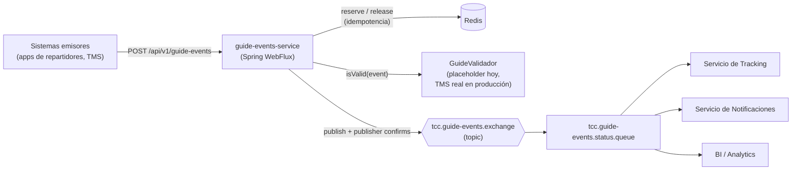
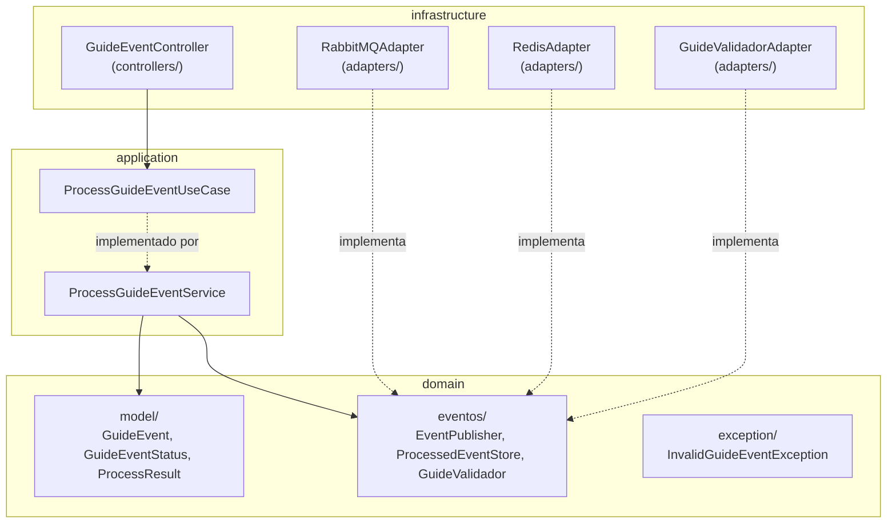
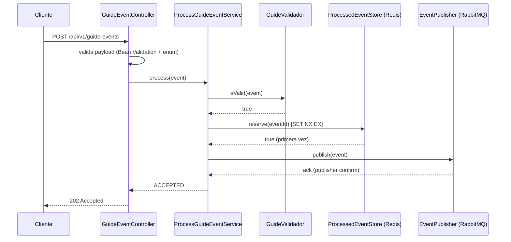
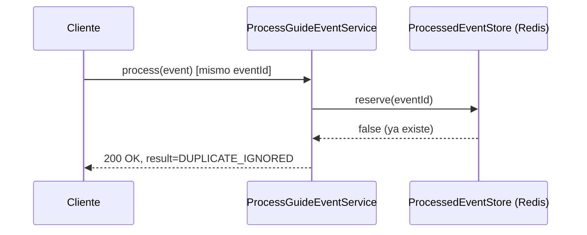
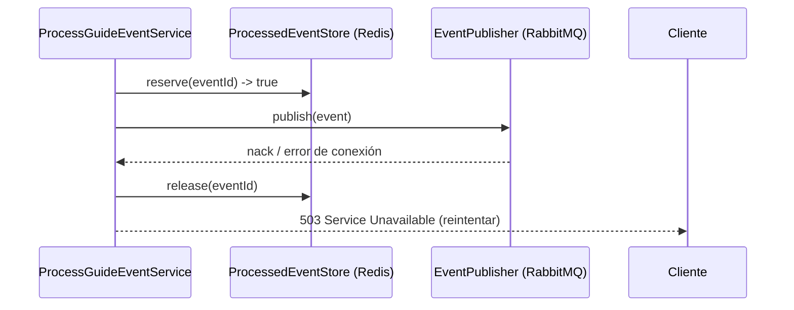

# Arquitectura técnica — guide-events-service

Documentación de soporte para la conversación técnica sobre la solución de alta concurrencia de eventos de guías (TCC). Complementa el [README](../README.md), que cubre cómo correr y probar el servicio; este documento cubre el *por qué* de las decisiones.

## 1. Contexto de negocio

En temporada pico, la generación y el rastreo de guías dispara el volumen de eventos de estado (creada, en tránsito, en reparto, entregada, novedad, devuelta, cancelada). Se necesita:

- **No perder eventos** aunque el broker o un servicio downstream tenga fallas transitorias.
- **No degradar la operación** — el servicio de ingesta debe seguir aceptando tráfico aunque sistemas externos (TMS, servicio de guías) estén lentos o caídos.
- **No duplicar efectos visibles al cliente** (una guía no debe generar dos notificaciones por el mismo evento).
- **Escalar horizontalmente** sin que la corrección dependa de que las peticiones caigan siempre en la misma instancia.

`guide-events-service` es el punto de entrada: recibe el evento, lo valida, evita procesarlo dos veces, y lo publica en un exchange de RabbitMQ para que lo consuman los sistemas de tracking, notificaciones y BI.

## 2. Arquitectura de alto nivel — componentes y flujo de datos

**Por qué un exchange topic:** permite enrutar a futuro por tipo de evento (ej. notificaciones solo para `ENTREGADA`) agregando bindings nuevos, sin tocar el productor ni los consumidores existentes.

## 3. Arquitectura interna: hexagonal (ports & adapters)

Las dependencias apuntan hacia adentro: `domain` y `application` no conocen Spring Web, RabbitMQ ni Redis. Cada tecnología concreta vive en un adaptador que implementa una interfaz declarada por el dominio (`domain/eventos`) — el mismo principio que un repositorio en DDD clásico: la interfaz expresa una necesidad del dominio, la implementación es un detalle de infraestructura reemplazable.

## 4. Flujo de una petición

### 4.1 Evento nuevo → aceptado

### 4.2 Evento duplicado → ignorado sin republicar

### 4.3 Falla al publicar → se libera la reserva

Liberar la reserva es la parte no obvia: si no se libera, un reintento legítimo del cliente encontraría la clave ya marcada y se trataría como duplicado — perdiendo el evento en vez de reintentarlo.

## 5. Decisiones de diseño y trade-offs

### 5.1 Reactivo de punta a punta (Mono), Flux solo donde la librería lo exige

Cada request HTTP es un evento — cardinalidad 1 — por eso `Mono` en controller, caso de uso e interfaces de dominio. `Flux` aparece únicamente en `RabbitMQAdapter`, porque `Sender.sendWithPublishConfirms` de reactor-rabbitmq está diseñado alrededor de `Flux` para lograr throughput (pipelining de confirmaciones sobre un mismo canal). Usar `Flux` en el resto sería forzar cardinalidad-N donde siempre hay un solo elemento.

**Ventaja:** ningún hilo se bloquea esperando el ack del broker — un pool pequeño de hilos Netty puede tener miles de requests concurrentes en vuelo, a diferencia de un stack bloqueante (Spring MVC + `RabbitTemplate`) donde la concurrencia real está topada por el tamaño del pool de hilos.
**Desventaja:** código reactivo es más difícil de leer/depurar que código imperativo para quien no está familiarizado con Project Reactor; stack traces menos directos.

### 5.2 Idempotencia: patrón *Idempotent Consumer* con reserva atómica en Redis

`ProcessedEventStore.reserve(eventId)` usa `SET NX EX` (atómico en Redis): si el mismo `eventId` llega dos veces casi al mismo tiempo —incluso a instancias distintas del servicio—, solo una gana la reserva y publica. Es el mismo patrón documentado en [microservices.io](https://microservices.io) como *Idempotent Consumer*, y el mismo mecanismo que usa Stripe con su header `Idempotency-Key` (retención de 24h en su caso; aquí 60 minutos, configurable).

**Por qué Redis y no una tabla relacional:** el patrón de acceso (escritura atómica, altísima frecuencia, vida corta con TTL nativo) es exactamente para lo que Redis está optimizado — un `SET NX EX` es sub-milisegundo, mientras una escritura transaccional en una BD relacional carga con overhead de bloqueo/log que no se necesita aquí. El TTL además es gratis en Redis; en una tabla relacional requeriría un job de limpieza aparte.

**Qué NO es esto:** no es un caché en el sentido clásico (memoizar un cálculo costoso) — es una primitiva de coordinación distribuida (deduplicación), por eso se usa el cliente Redis directo (`ReactiveStringRedisTemplate`) y no la abstracción `@Cacheable` de Spring.

**Límite consciente:** la deduplicación de largo plazo es responsabilidad del consumidor final (tracking/notificaciones), que de todas formas necesita su propia escritura idempotente por `eventId` — esta reserva en Redis es una salvaguarda de corto plazo contra publicaciones duplicadas inmediatas, no el mecanismo de idempotencia de todo el sistema extremo a extremo.

### 5.3 `GuideValidador`: puerto real, implementación placeholder explícita

Antes de aceptar un evento, el caso de uso pregunta `guideValidador.isValid(event)`. La interfaz vive en `domain/eventos` (mismo principio que un repositorio en DDD: expresa una necesidad del dominio). Hoy `GuideValidadorAdapter` siempre responde `true` — es un marcador de posición documentado en el propio código, no una base de datos ficticia.

**Por qué no se simuló con una BD real en este ejercicio:** no existe ningún otro sistema (TMS) con el que integrar en este alcance; inventar una tabla de guías agregaría la mayor complejidad nueva del proyecto para responder algo que, en producción, ya resuelve otro sistema. El puerto deja explícito *dónde* debe conectarse esa integración real, sin fingir que existe aquí.

### 5.4 Confirmaciones del broker (publisher confirms) — no perder eventos

El `Mono` de `publish()` solo completa cuando RabbitMQ confirma haber aceptado el mensaje (`sendWithPublishConfirms`). Si el broker no confirma o rechaza, la petición HTTP responde `503` para que el cliente reintente — nunca se responde éxito sin confirmación real del broker.

### 5.5 Qué queda deliberadamente fuera del código (temas de conversación, no de implementación)

| Tema | Por qué no está en el código | Cómo se resolvería |
|---|---|---|
| **Validación de existencia de guía / transición de estado** | Requeriría acoplar la disponibilidad de este servicio a la del TMS, o mantener estado local duplicado | Integración síncrona real detrás de `GuideValidador`, con circuit breaker |
| **Dead-letter queue** | No cambia la arquitectura, es una extensión de argumentos en `RabbitMQConfig` | `x-dead-letter-exchange` + cola DLQ |
| **Autenticación/autorización entre sistemas** | "Cualquiera con el API" es un problema de *quién* llama, no de *qué* datos llegan — no lo resuelve una BD de guías | API key / mTLS / OAuth2 en el borde (API Gateway) |
| **Observabilidad con métricas (Prometheus)** | Se explica como decisión de arquitectura | `micrometer-registry-prometheus` + contadores por resultado/estado |
| **Circuit breaker hacia RabbitMQ** | Bajo carga extrema sin breaker, cada request sigue intentando publicar contra un broker ya caído | Resilience4j alrededor de `EventPublisher` |

## 6. Escalabilidad

- **Horizontal:** el servicio es stateless en memoria de proceso — el único estado compartido (idempotencia) vive en Redis, accesible desde cualquier instancia. Escalar horizontalmente (más réplicas detrás de un balanceador) no rompe la corrección de la deduplicación.
- **Límite conocido:** el `Sender` de reactor-rabbitmq usa un solo canal AMQP por instancia por defecto. Aguanta pipelining de miles de mensajes sin confirmar, pero para concurrencia extrema la evolución natural es un pool pequeño de canales/Senders por instancia.
- **Redis en producción:** una sola instancia sin réplica es un punto único de falla para la deduplicación (no para la corrección de negocio, que vive en el consumidor). La evolución natural es Redis/Valkey con réplica + Sentinel o un servicio gestionado (no ligado a ningún proveedor de nube en particular).

## 7. Observabilidad

- **Métricas** (no implementadas, decisión documentada): Prometheus vía Micrometer, contadores de aceptados/duplicados/fallidos por `status`, con alertas sobre tasa de fallo de publicación.
- **Logs estructurados:** cada evento se loguea con `eventId`/`guideId`/`status` (ver `ProcessGuideEventService`); en producción irían a un agregador tipo Loki o ELK, correlacionable con las métricas desde el mismo Grafana.
- **Health checks:** `/actuator/health` ya expuesto, listo para `readinessProbe`/`livenessProbe` de Kubernetes.

## 8. Seguridad

No implementada en código en este ejercicio (decisión consciente de alcance), pero el requisito es real: el endpoint no debería aceptar tráfico sin autenticar. En producción, la autenticación entre sistemas (API key, mTLS, u OAuth2 client-credentials) se resolvería en el borde — API Gateway o un filtro dedicado — no mezclada con la lógica de validación de datos del evento.

## 9. De la idea a producción

- **CI:** `./gradlew clean check` (tests unitarios + gate de cobertura JaCoCo al 90%) en cada PR; bloquear merge si falla.
- **CD:** imagen de contenedor (`bootBuildImage` del plugin de Spring Boot para Gradle), publicada a un registry, desplegada a Kubernetes con `readinessProbe`/`livenessProbe` sobre `/actuator/health`.
- **Siguiente iteración, en orden de prioridad:** reemplazar `GuideValidadorAdapter` por la integración real con el TMS → dead-letter queue → autenticación entre sistemas → circuit breaker hacia RabbitMQ → métricas Prometheus.

## 10. Referencia rápida de archivos

Ver la sección "Arquitectura: hexagonal" del [README](../README.md) para la lista completa de paquetes y clases.
